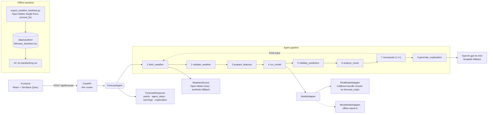

# WindAI — Agentic AI for Wind Farm Power Forecasting

Hackathon team repository for SYNC

WindAI forecasts the **hourly normalized active power (0–1)** of two wind turbines **24 or 48 hours ahead**. The test period is **February 2026**; training history runs from 2023-03-11 to 2026-01-31 (10-minute SCADA data).

The forecast is not a single model call. An agent fetches the weather, validates it, runs the model, validates the result, **analyses its own output and recomputes once if something is off**, and then explains the forecast. Every step calls a real service and reports its actual status and duration.

**Three things we want the jury to check:**

| | Claim | Where it is proven |
|---|---|---|
| 1 | **No data leakage.** Every forecast uses weather that was published *before* its origin, and a model trained *before* that origin. | [No data leakage](#1-no-data-leakage) — machine-checked on every row, 22 named tests |
| 2 | **The model beats the physical baseline.** CatBoost MAE is **−29%** vs the power-curve baseline on a 2-month hold-out. | [Model vs baselines](#2-the-model-beats-its-baselines), with the metric's limits stated |
| 3 | **A real agentic loop.** The agent analyses its result and recomputes on fresh input when a trigger fires. | [Agentic loop](#3-a-real-agentic-loop) |

---

## Architecture



**Data flow for one request.** The browser sends `{forecast_date, horizon_hours, turbine_ids}`. `WeatherService` returns one hourly weather frame per turbine in the agreed contract (`timestamp, wind_speed, temperature, forecast_origin, latitude, longitude`). `RealModelAdapter` picks the CatBoost bundle allowed for that origin and calls the ML package's `predict_with_models`. The agent validates the output, analyses it, may recompute, and asks OpenAI to explain the numbers it computed. The response carries the forecast plus the real `agent_steps`, which the dashboard plays back.

---

## Quick start

Requirements: Python 3.12+, Node.js 22+. Docker is optional.

### One command (Docker)

```bash
cp .env.example .env          # optional: put your OPENAI_API_KEY here (.env is git-ignored)
docker compose up --build     # backend :8000, frontend http://localhost:5173
```

Compose defaults to the **real CatBoost models** (bundled in the image) and **live Open-Meteo weather**. Without `OPENAI_API_KEY` the agent writes a template explanation instead of calling the LLM, and everything else works.

### Local

```bash
# Backend: real models need the ML inference stack (catboost)
cd backend
python -m venv .venv && source .venv/bin/activate
pip install -r requirements-ml.txt        # backend + ml/requirements-inference.txt
cp .env.example .env                      # then edit it; .env is git-ignored
#   (defaults: MODEL_ADAPTER=real → CatBoost models, WEATHER_PROVIDER=open_meteo → live weather)
#   OPENAI_API_KEY=<your-openai-key>  ← optional; empty = template explanation
uvicorn app.main:app --reload             # http://localhost:8000/docs

# Frontend (second terminal)
cd frontend
npm ci
npm run dev                               # http://localhost:5173
```

The trained model and live weather are the **defaults**: a plain `uvicorn app.main:app` serves CatBoost predictions. The offline stand-ins exist only for development and must be requested explicitly: `MODEL_ADAPTER=mock WEATHER_PROVIDER=mock` (then `requirements.txt` without CatBoost is enough).

**Where the OpenAI key goes:** into `backend/.env` for local runs or into the root `.env` for Docker. Both files are git-ignored. The OpenAI SDK reads `OPENAI_API_KEY` from the environment; the key never appears in code or in git.

### Tests and reproduction

```bash
cd backend && pytest                                              # 68 tests
cd ml && python -m unittest discover -s tests                     # 58 tests, ML environment (ml/requirements.txt)

python -m backend.scripts.export_weather_backtest                 # from repo root: re-export archived weather
cd ml && python -m src.backtesting.run \
  --weather ../data/weather/february_backtest.csv --output-dir data/backtests/february
```

The February backtest re-run reproduces the committed forecasts in `ml/reports/february_backtest/{24h,48h}/predictions.csv` **byte for byte**.

---

## 1. No data leakage

A forecast issued at `forecast_origin` may only use information available at that moment. We enforce this in three places and test each one.

### 1.1 Archived weather *forecasts*, as they were at the origin

- **Source:** the backtest weather comes from the **Open-Meteo Single Runs API**, model `ecmwf_ifs` (ECMWF IFS HRES 9 km). Each value belongs to one identified model run. We use no observed weather and no reanalysis.
- **Why not the Historical Forecast API:** it stitches the first hours of successive runs into one series, so a +30 h value would come from a run issued *after* the origin. The live dashboard uses it for convenience; the backtest never does (see [Limitations](#limitations-and-next-steps)).
- **Run selection:** each origin is 00:00 Asia/Almaty (19:00 UTC the day before). We take the newest run with `run_init + 6 h ≤ forecast_origin`, where 6 h is the upper bound of the publication delay Open-Meteo documents for global models. That is the 12Z run of the previous day, and the target hours sit 7–54 h after the run was initialised.
- **Machine check on every row:** `weather_valid_time = run_init + 6 h`, and the export asserts `weather_valid_time ≤ forecast_origin ≤ timestamp` for all 2,784 rows. One violation aborts the export.
- **No synthetic values:** if a run were missing, the block would go to `data/weather/february_backtest_skipped.csv` rather than be filled in. For February all 29 origins × 2 turbines were covered ([coverage report](reports/weather_backtest_export.md)).

### 1.2 A model trained strictly before each origin

| forecast_origin | Model bundle | Last training hour | Usable from |
|---|---|---|---|
| 2026-01-31 | `ml/models/asof_2026-01-31/turbine_N/` | 2026-01-30 23:00 | 2026-01-31 00:00 |
| 2026-02-01 … 2026-02-28 | `ml/models/turbine_N/` | 2026-01-31 23:00 | 2026-02-01 00:00 |

- **Selection rule:** `RealModelAdapter` picks the newest bundle with `training_last_available_at ≤ forecast_origin` (read from `metadata.json`). Origins earlier than every bundle are rejected.
- **Second guard:** independently of the adapter, the ML loader **refuses** to run the final model for the 31 January origin (`Leakage guard: model contains observations available at 2026-02-01 00:00…`).
- **Integrity:** every bundle's SHA-256, feature schema and cutoff are checked when the backend starts. A tampered model stops the server.

### 1.3 February actuals never reach training or features

- **No February power data was provided at all.** The history ends on 2026-01-31 at 23:50.
- **Code guards:** the training code still rejects February rows, the replay rejects any actual-power column in the weather input, and the model features are only the forecast `wind_speed` and `temperature` (no lagged power).

### Tests that prove it

**Backend** (`backend/tests/`, pytest):

| Test | What it proves |
|---|---|
| `test_weather_backtest_export.py::test_origin_is_local_midnight_utc_plus_5` | Origins are 00:00 Asia/Almaty = 19:00 UTC |
| `…::test_newest_candidate_is_12z_previous_day_and_all_are_published_before_origin` | Candidate runs are all published before the origin; the 18Z run is never chosen |
| `…::test_block_covers_48_hours_from_origin_and_passes_leakage_guard` | Exported rows satisfy `valid_time ≤ origin ≤ timestamp` |
| `…::test_leakage_guard_rejects_forecast_published_after_origin` | A forecast published after the origin aborts the export |
| `…::test_run_not_covering_horizon_is_rejected_not_padded` | Incomplete runs are rejected, never padded |
| `test_real_model.py::test_selects_newest_bundle_trained_strictly_before_origin` | 31 Jan → as-of bundle; 1–28 Feb → main bundle |
| `…::test_january_31_is_served_by_the_asof_model` | End-to-end prediction for 31 Jan uses the as-of model version |
| `…::test_ml_loader_itself_refuses_the_main_model_on_january_31` | The ML guard blocks the leak even if selection were wrong |
| `…::test_origin_before_every_bundle_is_rejected` | No bundle for 30 Jan → clear refusal |
| `…::test_corrupted_model_file_fails_fast` | A tampered `model.cbm` stops startup (SHA-256) |

**ML** (`ml/tests/`, unittest):

| Test | What it proves |
|---|---|
| `test_training.py::test_february_is_rejected_even_when_ineligible` | February rows cannot enter the training history |
| `test_training.py::test_train_cutoff_excludes_future_targets` | Changing power after the cutoff does not change the training set |
| `test_training.py::test_baselines_ignore_all_future_power_for_both_days` | Baselines do not see future power |
| `test_training.py::test_forged_availability_fails` | Forged availability metadata is rejected |
| `test_preprocess.py::test_future_values_cannot_change_an_earlier_hour` | Hourly aggregation never uses later samples |
| `test_predict.py::test_final_model_rejects_january_origin` | The final model refuses the 31 Jan origin |
| `test_backtesting.py::test_power_column_cannot_enter_replay` | Actual power in the weather input fails the replay |
| `test_backtesting.py::test_future_weather_run_rejected_before_output` | A weather run published after the origin fails before any output |
| `test_backtesting.py::test_january_snapshot_and_february_model_switch` | 31 Jan and February use different bundles |
| `test_csv_backtest.py::test_first_origin_rejects_final_models` | The CSV backtest refuses final models for 31 Jan |
| `test_csv_backtest.py::test_bad_valid_time_and_future_power_field_fail` | Bad `weather_valid_time` or a power field fails the run |
| `test_csv_backtest.py::test_future_run_and_false_availability_rejected` | Future runs and false availability claims are rejected |

---

## 2. The model beats its baselines

The hold-out period is **2025-12-01 – 2026-01-31**: 61 daily origins, 48-hour horizons, about 2,900 (origin, hour) pairs per turbine. Models were trained on data up to 2025-11-30 only.

| Turbine 1 | MAE ↓ | RMSE ↓ | R² ↑ |
|---|---:|---:|---:|
| **CatBoost (selected)** | **0.0244** | **0.0522** | **0.980** |
| Power curve | 0.0346 | 0.0564 | 0.976 |
| Persistence | 0.3520 | 0.4750 | −0.686 |
| Seasonal persistence | 0.3739 | 0.4891 | −0.788 |

| Turbine 2 | MAE ↓ | RMSE ↓ | R² ↑ |
|---|---:|---:|---:|
| **CatBoost (selected)** | **0.0281** | **0.0798** | **0.952** |
| Power curve | 0.0399 | 0.0831 | 0.948 |
| Persistence | 0.3513 | 0.4746 | −0.706 |
| Seasonal persistence | 0.3720 | 0.4879 | −0.802 |

**CatBoost lowers MAE by 29.4% (T1) and 29.6% (T2) versus the power curve.** RMSE improves less, by 7.4% and 4.0%. The model was chosen before the hold-out, on three earlier windows (2025-06, 2025-09, 2025-11), from power curve, HistGradientBoosting, CatBoost (weather) and CatBoost (weather + calendar). Its inputs are wind speed and temperature, and wind accounts for 96–98% of feature importance.

> **How to read these numbers.** The evaluation kind is `observed_weather_proxy`: the models received the **observed** wind at each target hour. These are scores of the **power model**, not **operational forecast accuracy**. A real forecast adds weather-forecast error on top. The fair comparison is CatBoost vs the power curve, because both receive the same observed wind. Persistence does not see weather at all, so its much larger gap mostly reflects the advantage of knowing the wind rather than the model. The API returns these metrics with this caveat attached (`GET /api/metrics → evaluation.note`).

---

## 3. A real agentic loop

```
fetch_weather → validate_weather → prepare_features → run_model → validate_prediction
      → analyze_result → recompute (at most once) → generate_explanation
```

Each step calls a real service, measures its wall-clock time and reports what actually happened. The dashboard plays back `agent_steps` from the response and does not invent progress. Example from a real run (1 Feb, 48 h, both turbines, live weather):

```
fetch_weather         591 ms  Loaded 48 hourly weather points … from the Open-Meteo Historical Forecast API.
run_model              28 ms  CatBoost model (catboost_weather-16a0619417f5, …-65cc90032f20) produced 96 hourly predictions.
validate_prediction     4 ms  96 predictions checked … Flagged 2 operational signal(s).
analyze_result          0 ms  No recompute needed — checked 0 clipped value(s), weather from open_meteo, 0/96 inconsistent hours.
recompute               —     skipped: Not needed: the analysis found no reason to recompute.
```

**What each step decides:**

| Step | Decision |
|---|---|
| `validate_weather` | Interpolates short gaps; stops the run on schema, continuity or physical-range errors; flags storms (≥ 25 m/s cut-out) and extreme cold |
| `validate_prediction` | Checks the contract, NaN, the 24/48 row count and hourly timestamps; clips values outside [0, 1]; flags sharp ramps, calm periods and near-zero output in strong wind |
| `analyze_result` | Decides whether a recompute is needed. **Triggers:** (a) values had to be clipped to [0, 1], either by the agent or by the model itself (read from `df.attrs["diagnostics"]`); (b) the forecast used fallback weather and the live provider answers on retry; (c) at least 10% of hours contradict the wind (output above 0.10 below cut-in, or below 0.05 at 10–25 m/s) |
| `recompute` | Re-runs fetch → validate → features → model → validate **once** on fresh input and adopts the result. If a trigger persists, it adds a caution warning. A failed recompute keeps the original validated forecast |
| `generate_explanation` | Sends only the computed numbers (averages, peak hours with wind, low-output window, warnings, recompute decision) to OpenAI `gpt-4o-mini` with a 10 s timeout. Any failure falls back to a deterministic template; `explanation_source` records which one was used |

All three triggers, the at-most-once limit, the fallbacks and the real-model path are covered by tests (`test_agent_loop.py`, `test_real_model.py`).

---

## Demo scenario

1. Start the app (`docker compose up --build`) and open <http://localhost:5173>.
2. Pick **2026-02-01**, **Both turbines**, **48h**, and click **Run AI Agent**.
3. Watch **Agent status** as the eight steps go `pending → running → completed/skipped`, each with its measured duration.
4. Check the **Power forecast** chart (y-axis fixed to 0–1, peak marked, hover for per-turbine values), the **Weather features**, and **Model metrics**, which show the real hold-out scores with their caveat.
5. Read the **AI explanation**, including the self-check verdict. The "Written by" line shows whether the LLM or the template wrote it.

Dates that show the agent reacting, all on **live weather for the real site**:

| Date | What the agent does |
|---|---|
| **2026-02-20** | Wind rises sharply: a ramp of **+0.90 of rated power within one hour** (21 Feb, 11:00) on both turbines → *"plan balancing reserve"* warnings |
| **2026-02-12** | Calm spell: average output below 10% → *"a calm period is expected"* warnings, and a low-output window in the explanation |
| **2026-02-05** | Ramp of +0.72 within one hour (6 Feb, 14:00) |

**Stress scenario (synthetic weather).** With `WEATHER_PROVIDER=mock`, **2026-02-22** produces a cold snap to **−32.9 °C**, and the agent raises *"outside standard cold-climate operating limits"* warnings. This uses the built-in synthetic weather generator, which is **not calibrated to the site**. On live weather the real site stays around −1 °C that day.

---

## API

| Endpoint | Description |
|---|---|
| `GET /api/health` | `{"status": "ok", "service": "wind-ai-backend"}` |
| `POST /api/forecast` | Body `{"forecast_date": "2026-02-01", "horizon_hours": 48, "turbine_ids": [1, 2]}`. Date must be 2026-02-01…28, horizon 24 or 48, turbines `[1]`, `[2]` or `[1, 2]`; invalid input returns 422 with a readable `detail`. Returns `summary`, per-turbine hourly `points`, `agent_steps`, `warnings`, `explanation`, `explanation_source`, `model_version`, `weather_source`. If the pipeline stops, `status` is `"failed"`, the failed step is marked and the later steps are `skipped` |
| `GET /api/metrics` | Hold-out MAE/RMSE/R² and `n` per turbine, plus `evaluation` (kind, period, caveat) when the real model is serving; demo values with `MODEL_ADAPTER=mock` |

Interactive docs are at <http://localhost:8000/docs>.

**ML contract.** The backend fetches the weather; the ML function never does:

```python
predict_power(turbine_id, weather, horizon_hours, forecast_origin) -> pd.DataFrame
# weather:  timestamp, wind_speed, temperature, forecast_origin, latitude, longitude
# output:   forecast_origin, timestamp, turbine_id, horizon_hour, wind_speed,
#           temperature, predicted_power, model_version
```

Timestamps are naive Asia/Almaty wall-clock times. The real model numbers `horizon_hour` 1…H, where 1 is the interval `[origin, origin+1h)`.

## Configuration (`backend/.env`, root `.env` for Docker)

| Variable | Default | Meaning |
|---|---|---|
| `MODEL_ADAPTER` | `real` | `real` = the trained CatBoost bundles from `ml/models`; if they cannot load, the server refuses to start (no silent fallback). `mock` = offline power-curve formula, development only |
| `WEATHER_PROVIDER` | `open_meteo` | `open_meteo` = live weather (if the API drops mid-run, synthetic weather is used *visibly*: warning, `weather_source: "mock"`, retry in `analyze_result`); `mock` = synthetic weather, development only |
| `OPENAI_API_KEY` | empty | Enables LLM explanations; empty = template |
| `OPENAI_MODEL` | `gpt-4o-mini` | LLM for the explanation step |
| `EXPLANATION_LANGUAGE` | `ru` | Language of the LLM explanation: `ru` (default, matches the Russian UI) or `en` |
| `TURBINE_MODEL_DIR` / `ML_PACKAGE_DIR` | `<repo>/ml/models` / `<repo>/ml` | Override model and ML package locations |
| `CORS_ORIGINS` | `http://localhost:5173` | Allowed frontend origins |

---

## Stack and repository

**Backend:** FastAPI, Pydantic v2, pandas, httpx, OpenAI SDK, pytest. **ML:** CatBoost, scikit-learn (model selection), pandas. **Frontend:** React 19, TypeScript (strict, no `any`), Vite, Tailwind CSS v4, TanStack Router and Query, Recharts, Motion.

```
backend/   FastAPI app: api/ (routes, DI) · agent/ (ForecastAgent, steps) · services/ (weather,
           analysis, metrics, LLM) · ml/ (Mock/Real adapters, predictor) · scripts/ (weather export) · tests/
frontend/  Dashboard, feature-sliced: app/ · pages/ · widgets/ · features/ · entities/ · shared/
ml/        Data audit, preprocessing, training, inference, backtesting · models/ (CatBoost bundles
           + metadata + metrics) · reports/ (data quality, model comparison, February backtest)
data/      weather/february_backtest.csv — archived forecasts for the backtest (+ skipped log)
reports/   weather_backtest_export.md — coverage and run-selection report
```

The Python ML component is in [ml/](ml/README.md). Stage 1 provides a reproducible
quality audit of both turbine CSV datasets. See the generated
[data quality report](ml/reports/data_quality.md) for findings and the staged plan.

---

## Limitations and next steps

We state these openly; each one is a known boundary, not a hidden gap.

- **Operational accuracy for February is not measured.** No February actual power was provided. The February forecasts already exist (`ml/reports/february_backtest/`, 1,392 × 24 h and 2,784 × 48 h rows from archived weather). Scoring them is one command once actuals arrive: `python -m src.backtesting.evaluate`.
- **Hold-out metrics are an observed-weather proxy.** They measure the power model; weather-forecast error is not included (see section 2).
- **The live dashboard's weather is not the backtest's weather.** The dashboard uses the Historical Forecast API, which is close to analysis and has look-ahead. Only the Single Runs export is used for evaluation.
- **Both turbines share one NWP grid cell** (they are about 350 m apart), so their weather inputs are identical. Differences between them come from the per-turbine models.
- **Model families not tried:** pooled (multi-turbine) models and LightGBM, both allowed by the brief. Candidates were limited to a power curve, HistGradientBoosting and two CatBoost variants.
- **The synthetic offline weather is not site-calibrated.** It exists so the app runs without network; use `open_meteo` for realistic results.

**Scaling:** more turbines means more bundles under `ml/models/turbine_N/` plus coordinates in `backend/app/core/constants.py`, with no agent changes. For a real operator: scheduled daily runs with persisted forecasts, forecast-vs-actual monitoring feeding the same `analyze_result` step, probabilistic output (P10/P50/P90), and SSE streaming of agent steps.
