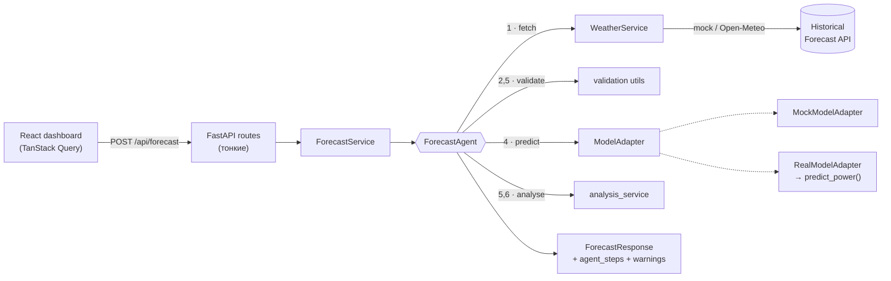

# WindAI — Agentic AI for Wind Farm Power Forecasting

Hackathon team repository for SYNC

**WindAI** прогнозирует почасовую выработку ветроэлектростанции на 24–48 часов вперёд. Прогноз строит не одиночный вызов модели, а **AI-агент**: он получает погоду, проверяет её, запускает ML-модель, валидирует результат, находит аномалии и объясняет вывод человеческим языком.

  

---

## Проблема

Выработка ВЭС напрямую зависит от ветра, а он сильно меняется. Диспетчеру нужен прогноз на сутки-двое вперёд, чтобы планировать баланс и резервы. Одного прогноза мощности мало: нужно понимать, **откуда взялись входные данные, можно ли им доверять и где риски** (штормовое отключение, резкие рампы, экстремальный холод).

## Решение

Агент-оркестратор выполняет конвейер из шести шагов. **Каждый шаг вызывает реальный сервис** и формирует статус по фактическому результату и замеренному времени:

| # | Шаг | Что делает агент | Как реагирует на проблемы |
|---|-----|------------------|---------------------------|
| 1 | `fetch_weather` | `WeatherService` получает почасовую погоду для координат каждой турбины | Если Open-Meteo недоступен → переключается на запасной источник и выдаёт warning |
| 2 | `validate_weather` | Схема контракта, число точек, почасовая непрерывность, физические диапазоны | Пропуски → интерполирует; мусорные данные → останавливает pipeline; шторм/мороз → warning |
| 3 | `prepare_features` | Собирает входные DataFrame строго по контракту с ML-частью | — |
| 4 | `run_model` | `ModelAdapter.predict(...)` для каждой турбины (параллельно) | Исключение в модели → шаг `failed`, остальные `skipped` |
| 5 | `validate_prediction` | NaN, границы `[0, 1]`, 24/48 точек, почасовые метки | Выход за `[0, 1]` → clip + warning; NaN → стоп; рампы и «ноль при сильном ветре» → warning |
| 6 | `generate_explanation` | Текстовое объяснение по статистике прогноза | — |

Фронтенд показывает **реальные** статусы шагов из ответа бэкенда — прогресс не выдумывается.

---

## Архитектура



```
wind-ai/
├── backend/                 FastAPI · Pydantic · Pandas
│   └── app/
│       ├── api/             роуты (health, forecast, metrics) + DI (deps.py)
│       ├── core/            config (env), константы, контрактные колонки
│       ├── schemas/         Pydantic-схемы запросов/ответов
│       ├── services/        weather, forecast, metrics, analysis
│       ├── agent/           ForecastAgent + примитивы шагов
│       ├── ml/              ModelAdapter · MockModelAdapter · RealModelAdapter
│       └── utils/           валидация, работа со временем
├── frontend/                React · TS · Vite · Tailwind v4 · FSD
│   └── src/
│       ├── app/             провайдеры, роутер, глобальные стили
│       ├── pages/           forecast, about
│       ├── widgets/         header, forecast-controls, forecast-chart, agent-activity,
│       │                    weather-panel, metrics-panel, turbine-summary, ai-explanation
│       ├── features/        select-forecast-date, select-turbine, select-horizon, run-forecast
│       ├── entities/        forecast, turbine, agent, metrics (типы, API, маппинг DTO)
│       └── shared/          UI-кит, API-клиент, утилиты, палитра
├── ml/                      ML-часть на Python (см. ml/README.md)
└── docker-compose.yml
```

## Стек

- **Backend:** Python 3.12+, FastAPI, Pydantic v2, pydantic-settings, Pandas, NumPy, httpx, Uvicorn, pytest
- **Frontend:** React 19, TypeScript (strict, без `any`), Vite, Tailwind CSS v4, TanStack Router, TanStack Query, Recharts, Motion, Lucide, cva + clsx + tailwind-merge

---

## Запуск

### Backend

```bash
cd backend
python -m venv .venv
source .venv/bin/activate
pip install -r requirements.txt
cp .env.example .env            # необязательно, значения по умолчанию рабочие
uvicorn app.main:app --reload
```

API: http://localhost:8000/api · Swagger: http://localhost:8000/docs

Тесты: `pip install -r requirements-dev.txt && pytest`

### Frontend

```bash
cd frontend
npm install
cp .env.example .env            # VITE_API_BASE_URL=http://localhost:8000/api
npm run dev
```

Откройте http://localhost:5173

### Docker

```bash
docker compose up --build
```

Backend → `:8000`, frontend → `:5173`.

### Конфигурация backend (`backend/.env`)

| Переменная | По умолчанию | Описание |
|---|---|---|
| `APP_NAME` | `WindAI` | Название сервиса |
| `ENV` | `development` | `development` / `production` / `test` |
| `CORS_ORIGINS` | `http://localhost:5173,…` | Разрешённые origin через запятую |
| `MODEL_ADAPTER` | `mock` | `mock` или `real` (реальная CatBoost-модель) |
| `WEATHER_PROVIDER` | `mock` | `mock` (детерминированная демо-погода, офлайн) или `open_meteo` (живой API с фолбэком на mock) |

---

## API

### `GET /api/health`
```json
{ "status": "ok", "service": "wind-ai-backend" }
```

### `POST /api/forecast`
```json
{ "forecast_date": "2026-02-01", "horizon_hours": 48, "turbine_ids": [1, 2] }
```
Валидация: дата 2026-02-01…2026-02-28; горизонт 24 или 48; турбины `[1]`, `[2]` или `[1, 2]`. Ошибки → `422` с читаемым `detail`.

Ответ (сокращённо):
```json
{
  "forecast_date": "2026-02-01",
  "horizon_hours": 48,
  "generated_at": "2026-09-23T12:00:00Z",
  "status": "completed",
  "summary": { "average_power": 0.57, "max_power": 0.98, "min_power": 0.16, "peak_hour": "2026-02-01T01:00:00" },
  "turbines": [{ "turbine_id": 1, "points": [{ "timestamp": "2026-02-01T00:00:00", "predicted_power": 0.94, "wind_speed": 10.2, "temperature": -8.9 }] }],
  "agent_steps": [{ "id": "fetch_weather", "title": "Fetch weather forecast", "status": "completed", "message": "Loaded 48 hourly weather points…", "duration_ms": 116 }],
  "warnings": [],
  "explanation": "Over the next 48 hours the agent expects moderate generation…",
  "model_version": "mock-sigmoid-v1",
  "weather_source": "mock"
}
```

- `status: "failed"` — агент остановился (например, модель вернула NaN). Тогда `summary = null`, `turbines = []`, упавший шаг имеет статус `failed`, последующие — `skipped`, а `explanation` описывает причину. HTTP-код всё равно `200`: это корректный результат работы агента.
- `summary`: `average/max/min` — по всем точкам выбранных турбин; `peak_hour` — час с максимальной средней мощностью по парку.

### `GET /api/metrics`
```json
{ "models": [{ "turbine_id": 1, "mae": 0.084, "rmse": 0.121, "r2": 0.78 }, { "turbine_id": 2, "mae": 0.091, "rmse": 0.134, "r2": 0.74 }], "source": "demo" }
```
Пока ML-часть не положила `backend/models/metrics.json`, отдаются демо-метрики (`source: "demo"`, во фронте бейдж «Demo metrics»).

---

## ML-часть

The Python ML component is in [ml/](ml/README.md). Stage 1 provides a reproducible
quality audit of both turbine CSV datasets. See the generated
[data quality report](ml/reports/data_quality.md) for findings and the staged plan.

---

## Контракт с ML-частью

> Согласовано с ML-инженером — не менять.

ML-часть предоставляет функцию:

```python
predict_power(
    turbine_id: int,
    weather: pd.DataFrame,   # columns: timestamp, wind_speed, temperature,
                             #          forecast_origin, latitude, longitude
    horizon_hours: int,      # 24 или 48
    forecast_origin: datetime,
) -> pd.DataFrame            # columns: forecast_origin, timestamp, turbine_id,
                             #          horizon_hour, wind_speed, temperature,
                             #          predicted_power, model_version
```

**Погоду получает бэкенд, а не ML-функция.** `WeatherService` загружает её (Open-Meteo Historical Forecast API: архив прогнозов NWP, т.е. ровно то, что было известно на момент выпуска прогноза) и передаёт в `ModelAdapter` уже готовый weather DataFrame. `predict_power` погоду сама **не** запрашивает.

Соглашения, которые фиксирует бэкенд:

| Поле | Значение |
|---|---|
| `forecast_origin` | Полночь (локальное время площадки) выбранной даты, например `2026-02-01 00:00` |
| `timestamp` | Почасовые метки без таймзоны, от `forecast_origin` включительно: `origin + 0h … origin + (H−1)h` |
| `horizon_hour` | `(timestamp − forecast_origin)` в часах: `0 … H−1` |
| `wind_speed` | м/с (в Open-Meteo — `wind_speed_100m`, ближайшая к высоте ступицы) |
| `temperature` | °C (`temperature_2m`) |
| `predicted_power` | Нормализованная активная мощность `0…1` (бэкенд всё равно валидирует и клипует) |

`ModelAdapter.predict(...)` повторяет эту сигнатуру один в один. `MockModelAdapter` возвращает DataFrame ровно этой формы (сигмоидная кривая мощности от скорости ветра + эффект плотности холодного воздуха + суточная компонента + шум, clip к `[0, 1]`), поэтому замена на реальную модель не затрагивает агента, роуты и фронтенд.

### Как подключить реальную модель

1. ML-инженер добавляет:
   - `backend/app/ml/predictor.py` с функцией `predict_power(...)` по контракту выше;
   - `backend/app/ml/features.py` — feature engineering модели;
   - `backend/models/turbine_1.cbm`, `backend/models/turbine_2.cbm`;
   - (опционально) `backend/models/metrics.json` — реальные метрики для `GET /api/metrics`.
2. Добавить `catboost` в `backend/requirements.txt`.
3. Указать `MODEL_ADAPTER=real` в `backend/.env`.

`RealModelAdapter` (`app/ml/real_model.py`) уже написан: он импортирует `predict_power` и выполняет синхронный CatBoost-инференс в thread pool, не блокируя event loop. Если `predictor.py` отсутствует, сервер при старте упадёт с понятной ошибкой, а не в середине запроса.

---

## Демо-сценарий

1. Запустите backend и frontend, откройте http://localhost:5173.
2. Выберите дату **2026-02-01**, **Both turbines**, горизонт **48h**.
3. Нажмите **Run AI Agent**.
4. Смотрите, как в карточке **Agent status** шаги агента проходят `pending → running → completed` с реальным временем выполнения.
5. Изучите график мощности (ось Y строго 0–1, отмечен пиковый час, тултип с обеими турбинами), погодные признаки и метрики модели.
6. Прочитайте **AI explanation**: уровень генерации, связь с ветром, окно низкой выработки, сравнение турбин.
7. Бонус: выберите **2026-02-22** — агент обнаружит экстремальный мороз (< −30 °C) и выдаст предупреждения.

---

## Дальнейшие шаги

- Подключить реальную CatBoost-модель (`MODEL_ADAPTER=real`) и реальные метрики валидации.
- Стриминг шагов агента в реальном времени (SSE) вместо одного ответа.
- Вероятностный прогноз (квантили P10/P50/P90) и доверительный коридор на графике.
- Сравнение прогноза с фактом за исторические даты (backtesting прямо в UI).
- LLM-слой для объяснений в свободной форме поверх текущих детерминированных сигналов.
- Детекция обледенения (нужны влажность и осадки из погодного API).
