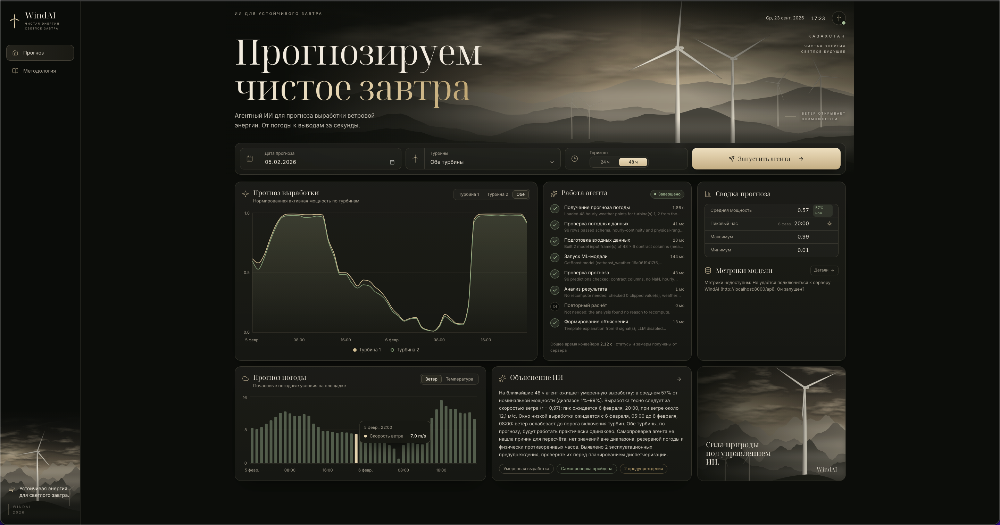
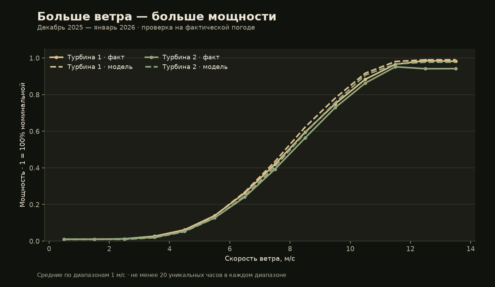
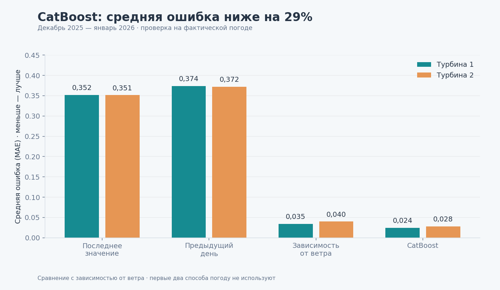
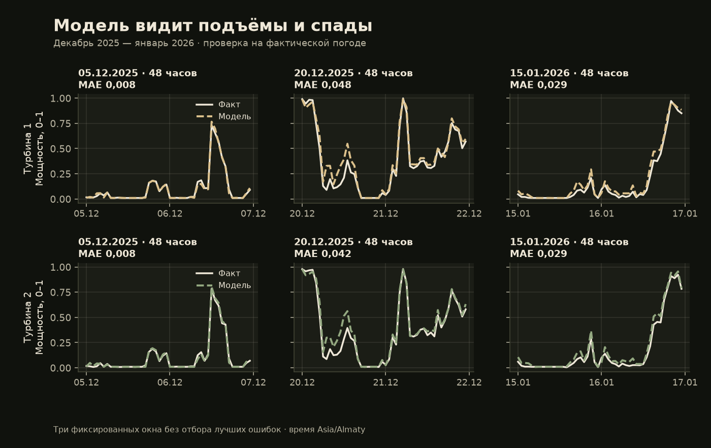
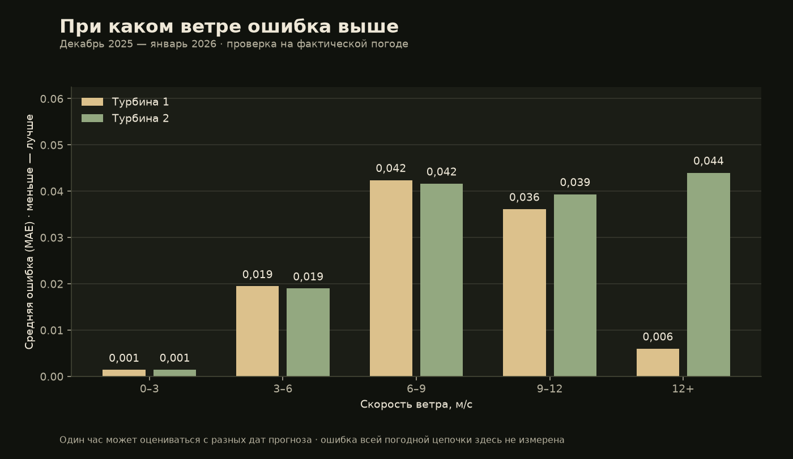

# WindAI — прогноз мощности ветровых турбин

**Ветер меняется. Энергосистеме нужен план.** WindAI помогает диспетчеру заранее увидеть, когда ветроэлектростанция даст больше энергии, а когда ожидается спад. Система превращает прогноз погоды в почасовой прогноз мощности двух турбин на **24–48 часов**, проверяет результат и объясняет его понятным языком.

**От погоды — к решению:** когда ждать пик мощности, на какие часы обратить внимание и почему меняется прогноз. Проект команды **SYNC**, HackAlemAI.

## Как выглядит WindAI в работе

Пользователь выбирает дату, турбины и горизонт прогноза, затем нажимает **«Запустить агента»**. На одном экране собраны графики, ход расчёта и объяснение — результат можно понять без изучения таблиц и кода.

*Скриншот нашего фронтенда: пример прогноза на 5–6 февраля 2026 года. Нажмите на изображение, чтобы рассмотреть детали.*

### Что показывает экран

- **Прогноз выработки:** две линии показывают, как будет меняться мощность турбин по часам. Шкала от 0 до 1 — от 0% до 100% номинальной мощности: сразу видны ожидаемые подъёмы и провалы.
- **Работа агента:** виден путь от получения и проверки погоды до запуска модели, проверки прогноза и формирования объяснения. У этапов есть статусы и время выполнения.
- **Сводка прогноза:** средняя мощность, пиковый час, максимум и минимум — основные ориентиры для планирования.
- **Погода и объяснение ИИ:** график погодных условий помогает сопоставить ветер с мощностью, а текст рядом объясняет ожидаемые изменения и обращает внимание на предупреждения.

**Как читать результат на этом примере:** средняя прогнозируемая мощность составляет **57% от номинальной**, а значения меняются примерно от **1% до 99%**. Утром 6 февраля ожидается спад, к вечеру — рост. Так диспетчер видит не только среднее за двое суток, но и конкретные часы, требующие внимания. Эти проценты описывают мощность в выбранном прогнозе, а не точность модели.

*Скриншот иллюстрирует интерфейс фронтенда; состояние интеграции в `main` описано ниже. На снимке блок метрик сообщает о недоступности сервера метрик — результаты проверки модели приведены отдельно в разделе «Что показала проверка».*

## Запуск и проверка

1. Установите и запустите Docker Desktop.
2. В папке проекта выполните `docker compose up --build` и откройте [localhost:5173](http://localhost:5173).
3. Выберите **1 февраля 2026**, **Both turbines**, **48h** и нажмите **Run AI Agent**. Изучите график, предупреждения и объяснение.

**В основной ветке `main` приложение пока запускается в демонстрационном режиме.** Обученные модели, прогнозы и отчёты уже включены в [папку `ml/`](ml/README.md) этой ветки. Подключение реальной модели к приложению подготовлено в [ветке `backend`](https://github.com/BAITC-Hacks/hack-bacd3af2-sync/tree/backend) и ещё не слито в `main`. Ниже — результаты проверки настоящей модели, а не демонстрационные числа интерфейса.

## Что показала проверка

Модель обучена на истории двух турбин. Качество проверено на последующих данных за **декабрь 2025 — январь 2026**, которые не участвовали в обучении проверяемой модели.

**Средняя ошибка — 2,44 и 2,81 процентного пункта номинальной мощности.** Это примерно на **29% меньше**, чем у простой зависимости мощности от скорости ветра.

Важно: при этой проверке погода уже была известна. Ошибка будущего прогноза погоды сюда не входит. Для февраля прогнозы сохранены, но оценить их точность пока нельзя — нет фактической мощности.

### 1. Сильнее ветер — выше мощность

Модель повторяет наблюдаемую зависимость: мощность растёт с ветром, затем достигает предела. Сплошные линии — измерения, пунктир — модель. **1 на шкале мощности означает 100% номинальной мощности.** Бирюзовый цвет — первая турбина, оранжевый — вторая.

### 2. Модель точнее простых способов расчёта

**Чем ниже столбец, тем меньше ошибка.** Слева направо: повтор последнего значения, повтор предыдущего дня, расчёт по зависимости от ветра и наша модель CatBoost. Сравнение с третьим способом даёт улучшение примерно на 29%; первые два способа погоду не используют.

### 3. Модель отслеживает подъёмы и спады

Тёмная линия — реальная мощность, цветной пунктир — расчёт модели. На трёх примерах видны и совпадения, и ошибки. Верхний ряд — первая турбина, нижний — вторая.

### 4. Где прогнозу сложнее доверять

**Ниже столбец — меньше ошибка.** При слабом ветре абсолютная ошибка мала. При среднем и сильном ветре она возрастает; особенно заметна разница между турбинами при ветре от 12 м/с. Это помогает увидеть ограничения модели, а не только её средний результат.

## На чём работает проект

**React** — интерфейс и графики; **Python и FastAPI** — сервер и проверки; **CatBoost** — модель мощности; **Open-Meteo** — погода; **Docker** — запуск приложения.

Для архивной проверки использованы только прогнозы погоды, доступные на момент расчёта, и модели, обученные на более ранних данных. Фактическая мощность февраля в обучение не входит.

Подробнее: [сравнение моделей](ml/reports/model_comparison.md) · [аудит и ограничения](ml/reports/ml_audit.md) · [февральские прогнозы](ml/reports/february_backtest/README.md) · [инструкции для разработчиков](ml/README.md).
