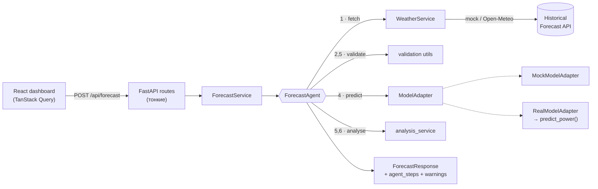

# WindAI — Agentic AI for Wind Farm Power Forecasting

Hackathon team repository for SYNC

**WindAI** прогнозирует почасовую выработку ветроэлектростанции на 24–48 часов вперёд. Прогноз строит не одиночный вызов модели, а **AI-агент**: он получает погоду, проверяет её, запускает ML-модель, валидирует результат, находит аномалии и объясняет вывод человеческим языком.

  

---

## Проблема

Выработка ВЭС напрямую зависит от ветра, а он сильно меняется. Диспетчеру нужен прогноз на сутки-двое вперёд, чтобы планировать баланс и резервы. Одного прогноза мощности мало: нужно понимать, **откуда взялись входные данные, можно ли им доверять и где риски** (штормовое отключение, резкие рампы, экстремальный холод).

## Решение

Агент-оркестратор выполняет конвейер из восьми шагов и замыкает цикл: анализирует собственный результат и при необходимости один раз пересчитывает прогноз. **Каждый шаг вызывает реальный сервис** и формирует статус по фактическому результату и замеренному времени:

| # | Шаг | Что делает агент | Как реагирует на проблемы |
|---|-----|------------------|---------------------------|
| 1 | `fetch_weather` | `WeatherService` получает почасовую погоду для координат каждой турбины | Если Open-Meteo недоступен → переключается на запасной источник и выдаёт warning |
| 2 | `validate_weather` | Схема контракта, число точек, почасовая непрерывность, физические диапазоны | Пропуски → интерполирует; мусорные данные → останавливает pipeline; шторм/мороз → warning |
| 3 | `prepare_features` | Собирает входные DataFrame строго по контракту с ML-частью | — |
| 4 | `run_model` | `ModelAdapter.predict(...)` для каждой турбины (параллельно) | Исключение в модели → шаг `failed`, остальные `skipped` |
| 5 | `validate_prediction` | NaN, границы `[0, 1]`, 24/48 точек, почасовые метки | Выход за `[0, 1]` → clip + warning; NaN → стоп; рампы и «ноль при сильном ветре» → warning |
| 6 | `analyze_result` | Самопроверка прогноза: были ли обрезаны значения вне `[0, 1]`; бралась ли погода из демо-фолбэка и ответил ли основной провайдер при повторной попытке; доля часов, где мощность противоречит ветру (штиль, но выработка / сильный ветер, но простой) | Любой триггер → решение о пересчёте с перечислением причин |
| 7 | `recompute` | Один повторный прогон `fetch → validate → prepare → run → validate` на свежем входе (при восстановлении основного провайдера — на его погоде) | Не нужен → `skipped` с причиной; триггер не ушёл → warning; пересчёт упал → исходный прогноз сохраняется (шаг некритичный). Максимум один повтор |
| 8 | `generate_explanation` | Объяснение через LLM (OpenAI) по фактическим числам прогноза, включая решение о пересчёте | Нет ключа или LLM недоступен → шаблонное объяснение, агент не падает |

Фронтенд показывает **реальные** статусы шагов из ответа бэкенда — прогресс не выдумывается.

---

## Архитектура



```
wind-ai/
├── backend/                 FastAPI · Pydantic · Pandas
│   └── app/
│       ├── api/             роуты (health, forecast, metrics) + DI (deps.py)
│       ├── core/            config (env), константы, контрактные колонки
│       ├── schemas/         Pydantic-схемы запросов/ответов
│       ├── services/        weather, forecast, metrics, analysis
│       ├── agent/           ForecastAgent + примитивы шагов
│       ├── ml/              ModelAdapter · MockModelAdapter · RealModelAdapter
│       └── utils/           валидация, работа со временем
├── frontend/                React · TS · Vite · Tailwind v4 · FSD
│   └── src/
│       ├── app/             провайдеры, роутер, глобальные стили
│       ├── pages/           forecast, about
│       ├── widgets/         header, forecast-controls, forecast-chart, agent-activity,
│       │                    weather-panel, metrics-panel, turbine-summary, ai-explanation
│       ├── features/        select-forecast-date, select-turbine, select-horizon, run-forecast
│       ├── entities/        forecast, turbine, agent, metrics (типы, API, маппинг DTO)
│       └── shared/          UI-кит, API-клиент, утилиты, палитра
├── ml/                      ML-часть на Python (см. ml/README.md)
└── docker-compose.yml
```

## Стек

- **Backend:** Python 3.12+, FastAPI, Pydantic v2, pydantic-settings, Pandas, NumPy, httpx, Uvicorn, pytest
- **Frontend:** React 19, TypeScript (strict, без `any`), Vite, Tailwind CSS v4, TanStack Router, TanStack Query, Recharts, Motion, Lucide, cva + clsx + tailwind-merge

---

## Запуск

### Backend

```bash
cd backend
python -m venv .venv
source .venv/bin/activate
pip install -r requirements.txt
cp .env.example .env            # необязательно, значения по умолчанию рабочие
uvicorn app.main:app --reload
```

API: http://localhost:8000/api · Swagger: http://localhost:8000/docs

Тесты: `pip install -r requirements-dev.txt && pytest`

### Frontend

```bash
cd frontend
npm install
cp .env.example .env            # VITE_API_BASE_URL=http://localhost:8000/api
npm run dev
```

Откройте http://localhost:5173

### Docker

```bash
docker compose up --build
```

Backend → `:8000`, frontend → `:5173`.

### Конфигурация backend (`backend/.env`)

| Переменная | По умолчанию | Описание |
|---|---|---|
| `APP_NAME` | `WindAI` | Название сервиса |
| `ENV` | `development` | `development` / `production` / `test` |
| `CORS_ORIGINS` | `http://localhost:5173,…` | Разрешённые origin через запятую |
| `MODEL_ADAPTER` | `mock` | `mock` или `real` (CatBoost-модели ML-части; нужен `pip install -r requirements-ml.txt`) |
| `TURBINE_MODEL_DIR` | `<repo>/ml/models` | Корень основных бандлов `turbine_N/`; снимки `asof_*/` — внутри |
| `ML_PACKAGE_DIR` | `<repo>/ml` | Путь к ML-пакету (`src/`) для `MODEL_ADAPTER=real` |
| `OPENAI_API_KEY` | пусто | Ключ OpenAI API для шага `generate_explanation`; его читает сам OpenAI SDK. Пусто → шаблонное объяснение без сетевых вызовов |
| `OPENAI_MODEL` | `gpt-4o-mini` | Модель для объяснения (таймаут запроса 10 с) |
| `EXPLANATION_LANGUAGE` | `en` | Язык объяснения: `en` или `ru` |
| `WEATHER_PROVIDER` | `mock` | `mock` (детерминированная демо-погода, офлайн) или `open_meteo` (Open-Meteo Historical Forecast API с фолбэком на mock; только для демо, не для оценки качества — см. [погодные данные](#погодные-данные-живое-демо-и-backtest)) |

---

## API

### `GET /api/health`
```json
{ "status": "ok", "service": "wind-ai-backend" }
```

### `POST /api/forecast`
```json
{ "forecast_date": "2026-02-01", "horizon_hours": 48, "turbine_ids": [1, 2] }
```
Валидация: дата 2026-02-01…2026-02-28; горизонт 24 или 48; турбины `[1]`, `[2]` или `[1, 2]`. Ошибки → `422` с читаемым `detail`.

Ответ (сокращённо):
```json
{
  "forecast_date": "2026-02-01",
  "horizon_hours": 48,
  "generated_at": "2026-09-23T12:00:00Z",
  "status": "completed",
  "summary": { "average_power": 0.57, "max_power": 0.98, "min_power": 0.16, "peak_hour": "2026-02-01T01:00:00" },
  "turbines": [{ "turbine_id": 1, "points": [{ "timestamp": "2026-02-01T00:00:00", "predicted_power": 0.94, "wind_speed": 10.2, "temperature": -8.9 }] }],
  "agent_steps": [{ "id": "fetch_weather", "title": "Fetch weather forecast", "status": "completed", "message": "Loaded 48 hourly weather points…", "duration_ms": 116 }],
  "warnings": [],
  "explanation": "Over the next 48 hours the agent expects moderate generation…",
  "model_version": "mock-sigmoid-v1",
  "weather_source": "mock"
}
```

- `status: "failed"` — агент остановился (например, модель вернула NaN). Тогда `summary = null`, `turbines = []`, упавший шаг имеет статус `failed`, последующие — `skipped`, а `explanation` описывает причину. HTTP-код всё равно `200`: это корректный результат работы агента.
- `summary`: `average/max/min` — по всем точкам выбранных турбин; `peak_hour` — час с максимальной средней мощностью по парку.
- `explanation_source`: `"llm"` — объяснение написала модель OpenAI, `"template"` — встроенный шаблон (ключ не задан или LLM недоступен).

**Объяснение через LLM.** В OpenAI (`chat.completions`) уходят только числа, которые агент уже посчитал: средняя/мин/макс мощность, три пиковых часа с ветром, окно низкой выработки, диапазоны ветра и температуры, корреляция, мощность по турбинам, предупреждения и решение о пересчёте. Модель получает инструкцию не придумывать значений. Любая ошибка — нет или неверный ключ, сеть, таймаут, лимит или квота, отказ модели, обрезанный или пустой ответ — переводит шаг на шаблонное объяснение, агент не падает.

### `GET /api/metrics`
При `MODEL_ADAPTER=real` — реальные метрики обслуживающих CatBoost-моделей из `ml/models/turbine_N/metrics.json` (блок `holdout`, выбранная модель):
```json
{
  "models": [
    { "turbine_id": 1, "mae": 0.0244, "rmse": 0.0522, "r2": 0.9796, "n": 2920 },
    { "turbine_id": 2, "mae": 0.0281, "rmse": 0.0798, "r2": 0.9518, "n": 2908 }
  ],
  "source": "holdout",
  "evaluation": {
    "kind": "observed_weather_proxy",
    "period_start": "2025-12-01",
    "period_end": "2026-01-31",
    "note": "Power-model scores on a hold-out period driven by observed weather. Not operational forecast accuracy: weather-forecast error is not included."
  }
}
```
Это качество **модели мощности** на исторических часах с *наблюдённой* погодой, а не точность операционного прогноза: ошибка прогноза погоды в них не входит (как указано в отчёте ML). При `MODEL_ADAPTER=mock`, а также если файла метрик нет или он повреждён, отдаются демо-значения: `"source": "demo"`, `"evaluation": null`, во фронте бейдж «Demo metrics».

---

## ML-часть

The Python ML component is in [ml/](ml/README.md). Stage 1 provides a reproducible
quality audit of both turbine CSV datasets. See the generated
[data quality report](ml/reports/data_quality.md) for findings and the staged plan.

---

## Контракт с ML-частью

> Согласовано с ML-инженером — не менять.

ML-часть предоставляет функцию:

```python
predict_power(
    turbine_id: int,
    weather: pd.DataFrame,   # columns: timestamp, wind_speed, temperature,
                             #          forecast_origin, latitude, longitude
    horizon_hours: int,      # 24 или 48
    forecast_origin: datetime,
) -> pd.DataFrame            # columns: forecast_origin, timestamp, turbine_id,
                             #          horizon_hour, wind_speed, temperature,
                             #          predicted_power, model_version
```

**Погоду получает бэкенд, а не ML-функция.** Бэкенд загружает её и передаёт в `ModelAdapter` уже готовый weather DataFrame. `predict_power` погоду сама **не** запрашивает. Источников погоды два, и у них разное назначение — см. раздел [«Погодные данные: живое демо и backtest»](#погодные-данные-живое-демо-и-backtest).

Соглашения, которые фиксирует бэкенд:

| Поле | Значение |
|---|---|
| `forecast_origin` | Полночь (локальное время площадки) выбранной даты, например `2026-02-01 00:00` |
| `timestamp` | Почасовые метки без таймзоны, от `forecast_origin` включительно: `origin + 0h … origin + (H−1)h` |
| `horizon_hour` | Номер часа горизонта. Реальная модель: `1 … H`, где `1` — интервал `[origin, origin+1h)`. Mock: `0 … H−1`. Метки `timestamp` у обоих одинаковые (первая = origin); бэкенд `horizon_hour` не использует |
| `wind_speed` | м/с (в Open-Meteo — `wind_speed_100m`, ближайшая к высоте ступицы) |
| `temperature` | °C (`temperature_2m`) |
| `predicted_power` | Нормализованная активная мощность `0…1` (бэкенд всё равно валидирует и клипует) |

`ModelAdapter.predict(...)` повторяет эту сигнатуру один в один. `MockModelAdapter` возвращает DataFrame ровно этой формы (сигмоидная кривая мощности от скорости ветра + эффект плотности холодного воздуха + суточная компонента + шум, clip к `[0, 1]`), поэтому замена на реальную модель не затрагивает агента, роуты и фронтенд.

### Реальная модель (CatBoost от ML-части)

Модели и inference-пакет лежат в `ml/` (`ml/src/inference`, бандлы `ml/models/…`). Бэкенд подключает их без копирования кода модели:

```bash
cd backend
pip install -r requirements-ml.txt      # backend + ml/requirements-inference.txt (catboost, scipy)
MODEL_ADAPTER=real uvicorn app.main:app --reload
```

- `app/ml/predictor.py` — переходник из `ml/integration/predictor.py`. `RealModelAdapter` сам добавляет `ml/` в `sys.path` (путь — `ML_PACKAGE_DIR`, по умолчанию `<repo>/ml`).
- Бандл = `model.cbm` + `metadata.json`; загрузчик ML-части проверяет признаки, SHA-256 и границу обучения. При старте бэкенд загружает **все** бандлы: битый или отсутствующий артефакт останавливает сервер с понятной ошибкой. Тихого переключения на mock нет — `MODEL_ADAPTER=mock` включается только явно.
- **Выбор модели по `forecast_origin` (антилик).** Для каждого запроса берётся самый свежий бандл, у которого `training_last_available_at ≤ forecast_origin`:

  | forecast_origin | Бандл | Обучен до |
  |---|---|---|
  | 2026-02-01 и позже | `ml/models/turbine_N/` | 31.01.2026 включительно |
  | 2026-01-31 | `ml/models/asof_2026-01-31/turbine_N/` | 30.01.2026 включительно |
  | раньше 2026-01-31 | — | запрос отклоняется |

  Основные модели обучены в том числе на 31 января, поэтому для origin 31 января они дали бы leakage. Загрузчик ML-части дополнительно отклоняет модель, обученную позже origin (вторая линия защиты). `TURBINE_MODEL_DIR` переопределяет корень основных бандлов; снимки `asof_*` ищутся в его подкаталогах.
- Ошибка конкретного запроса (невалидная погода, нет подходящего бандла) — шаг `run_model` получает статус `failed` с текстом причины.
- `GET /api/metrics` отдаёт hold-out метрики этих моделей (см. раздел API).
- Модель сама обрезает сырой выход до `[0, 1]` и сообщает об этом в `df.attrs['diagnostics']`. Агент учитывает эти счётчики как обрезку, поэтому триггер пересчёта в `analyze_result` срабатывает одинаково на mock и на реальной модели.

---

## Погодные данные: живое демо и backtest

Бэкенд получает погоду двумя разными путями. Путать их нельзя: только второй годится для честной оценки модели.

| | Живой дашборд | Строгий backtest |
|---|---|---|
| Где | `WeatherService` → `POST /api/forecast` | `python -m backend.scripts.export_weather_backtest` |
| Источник | Open-Meteo **Historical Forecast API** (`WEATHER_PROVIDER=open_meteo`) или демо-генератор (`mock`) | Open-Meteo **Single Runs API**, модель `ecmwf_ifs` (ECMWF IFS HRES 9 km) |
| Что это за данные | Непрерывный ряд, склеенный из первых часов последовательных прогонов модели. Значения **ближе к анализу**, чем к прогнозу, выпущенному в момент `forecast_origin` | Один прогон целиком, выпущенный **до** `forecast_origin`, с известным временем инициализации |
| Look-ahead | **Есть**: цель через +30 ч взята из прогона, выпущенного позже origin | **Нет**: для каждой строки проверяется `weather_valid_time ≤ forecast_origin ≤ timestamp` |
| Назначение | Интерактивное демо: правдоподобная погода для выбранной даты | Бэктест ML-части и метрики качества |
| Результат | Ответ API, в файл не сохраняется | `data/weather/february_backtest.csv` + [отчёт о покрытии](reports/weather_backtest_export.md) |

**Правило выбора прогона в backtest.** Origin — полночь по `Asia/Almaty` (19:00 UTC предыдущих суток). Берётся самый свежий прогон, для которого `run_init + 6 ч ≤ forecast_origin`, где 6 ч — верхняя граница задержки публикации глобальных моделей по документации Open-Meteo. Для февраля 2026 это прогон 12Z предыдущих суток. Поле `weather_valid_time = run_init + 6 ч` фиксирует момент, когда прогноз стал доступен. Заблаговременность целевых часов от выпуска — 7–54 ч. Если прогон отсутствует в архиве, пробуются более ранние реальные прогоны; значения никогда не дорисовываются, пропуски попадают в `data/weather/february_backtest_skipped.csv`.

Поэтому метрики качества, посчитанные на погоде живого дашборда, будут завышены. Для оценки использовать только backtest-CSV.

---

## Демо-сценарий

1. Запустите backend и frontend, откройте http://localhost:5173.
2. Выберите дату **2026-02-01**, **Both turbines**, горизонт **48h**.
3. Нажмите **Run AI Agent**.
4. Смотрите, как в карточке **Agent status** шаги агента проходят `pending → running → completed` с реальным временем выполнения.
5. Изучите график мощности (ось Y строго 0–1, отмечен пиковый час, тултип с обеими турбинами), погодные признаки и метрики модели.
6. Прочитайте **AI explanation**: уровень генерации, связь с ветром, окно низкой выработки, сравнение турбин.
7. Бонус: выберите **2026-02-22** — агент обнаружит экстремальный мороз (< −30 °C) и выдаст предупреждения.

---

## Дальнейшие шаги

- Операционные метрики по архивным прогнозам погоды (февральский backtest) рядом с hold-out метриками модели.
- Стриминг шагов агента в реальном времени (SSE) вместо одного ответа.
- Вероятностный прогноз (квантили P10/P50/P90) и доверительный коридор на графике.
- Сравнение прогноза с фактом за исторические даты (backtesting прямо в UI).
- LLM-слой для объяснений в свободной форме поверх текущих детерминированных сигналов.
- Детекция обледенения (нужны влажность и осадки из погодного API).
