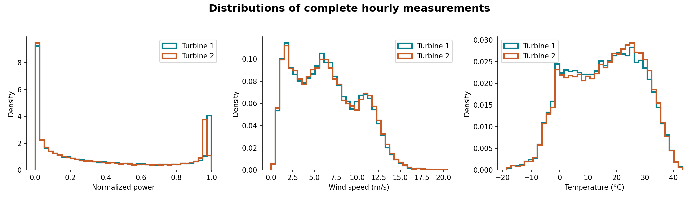
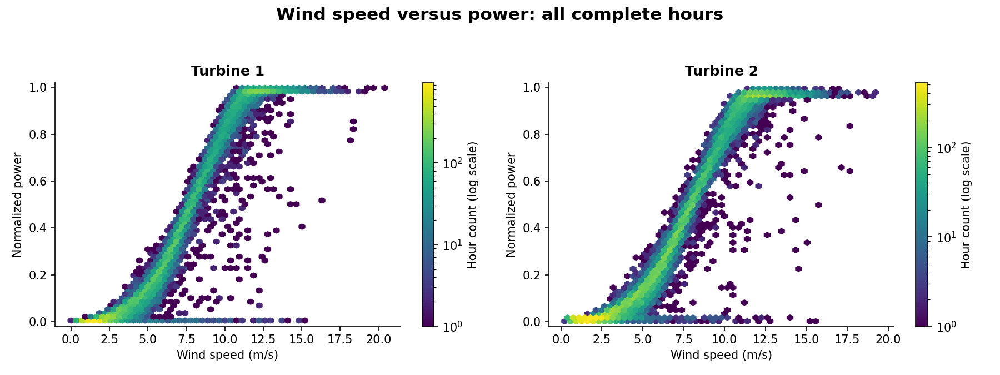
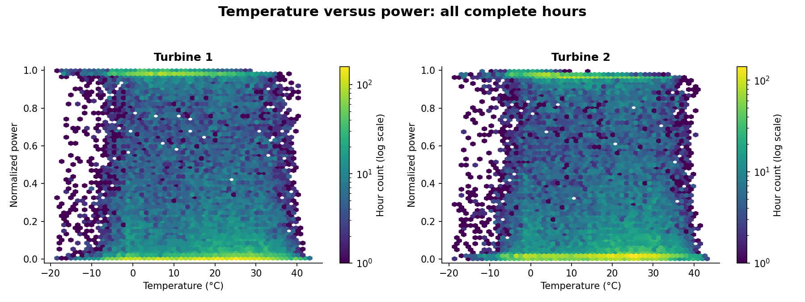
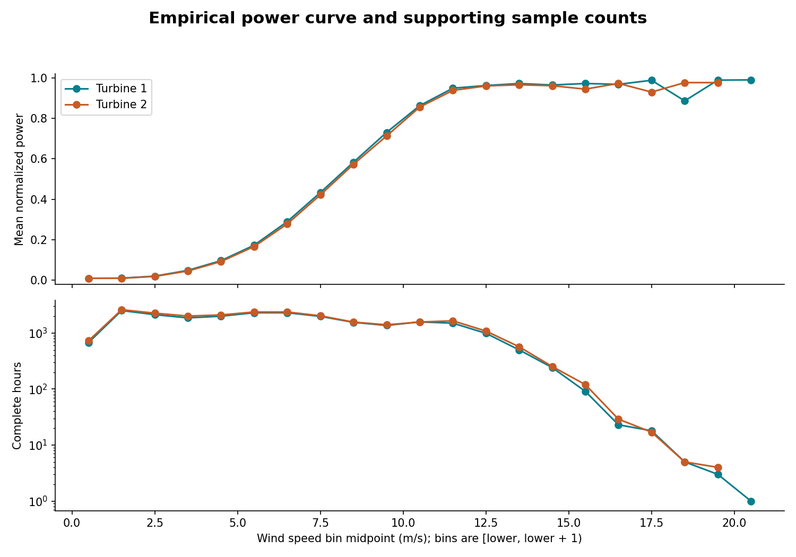
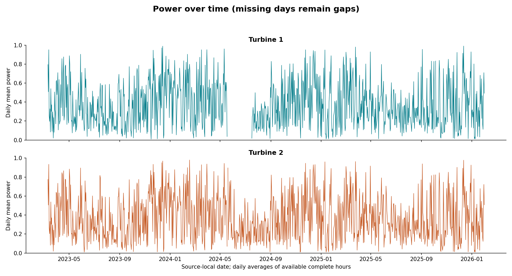
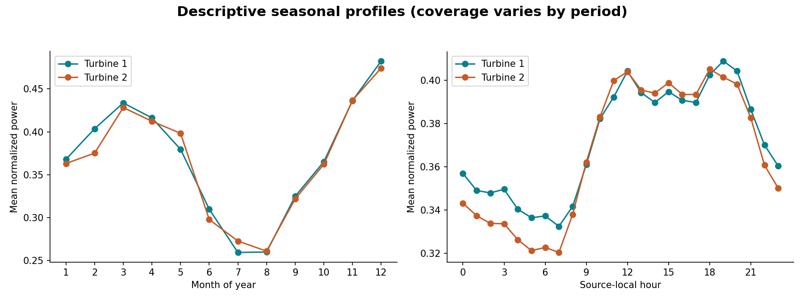
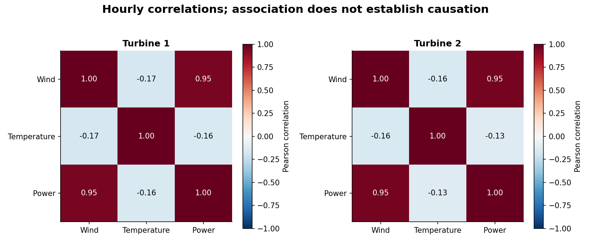
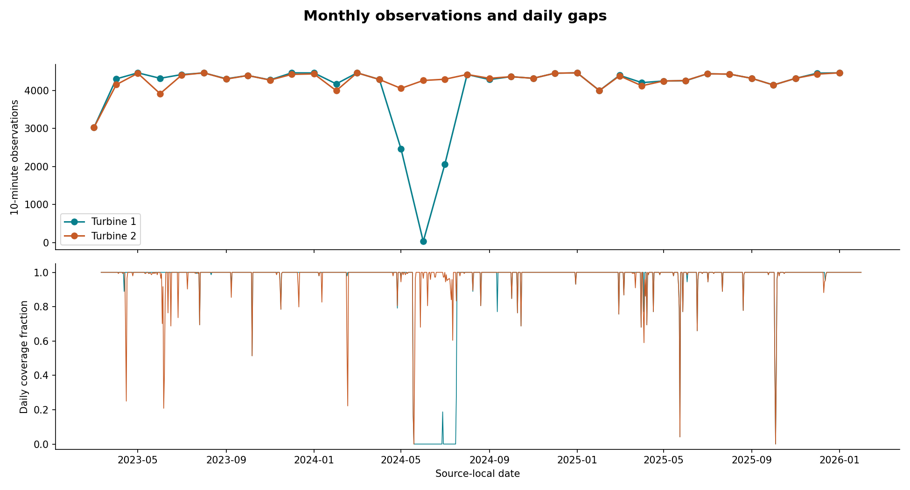
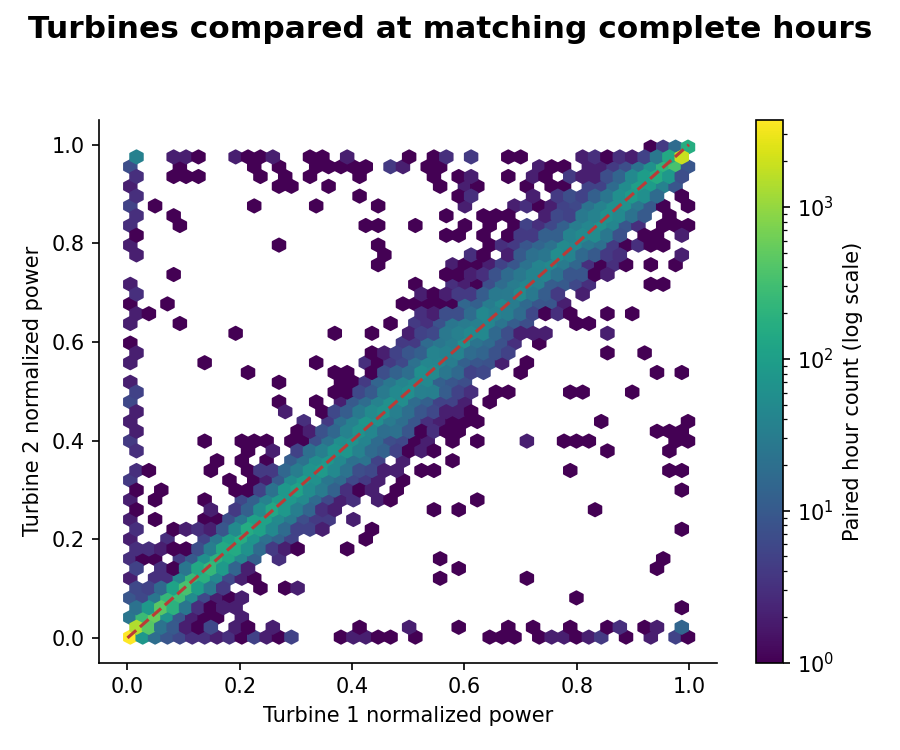

# Exploratory data analysis

Stage 2 uses the supplied historical measurements only. These are descriptive statistics, not forecast validation scores.

Sensor charts use hours with six finite, physically admissible values for every sensor. Coverage charts include every hour. No imputation is applied.

| Turbine | Total hours | Complete hours | Empty hours | Partial hours |
| --- | ---: | ---: | ---: | ---: |
| 1 | 25392 | 23667 | 1629 | 96 |
| 2 | 25392 | 24785 | 388 | 219 |

Turbine comparison uses 23,444 matching complete hours. Mean absolute power difference: 0.0260 normalized units.

## Wind and power findings

Fixed wind bins describe the empirical relationship; counts expose how much evidence supports each mean.

| Turbine | Wind bin (m/s) | Mean normalized power | Complete hours |
| --- | --- | ---: | ---: |
| 1 | [3, 4) | 0.0490 | 1866 |
| 1 | [7, 8) | 0.4336 | 1984 |
| 1 | [11, 12) | 0.9489 | 1503 |
| 1 | [13, 14) | 0.9721 | 501 |
| 1 | [18, 19) | 0.8863 | 5 |
| 2 | [3, 4) | 0.0458 | 2010 |
| 2 | [7, 8) | 0.4220 | 2031 |
| 2 | [11, 12) | 0.9381 | 1654 |
| 2 | [13, 14) | 0.9658 | 569 |
| 2 | [18, 19) | 0.9767 | 5 |

For these datasets, the curves rise steeply through intermediate wind speeds and approach a plateau around 11–13 m/s. Both turbines have similar curves. The thin high-wind tail cannot establish a cut-out threshold.

The paired plot also contains observations far from equal output. Retain these for review; the supplied columns alone cannot establish whether curtailment, availability or sensor behavior explains the differences.

## Interpretation limits

- Power curves use fixed 1 m/s bins and include counts. Sparse high-wind bins should not determine a cut-out rule or extrapolation policy.
- Seasonal profiles pool years and reflect the available coverage. Missing periods can bias these averages.
- The hourly target is the arithmetic mean of six equally spaced power samples, not energy in kWh.
- Wind and temperature here are observed measurements. They cannot replace archived forecast weather in a historical operational backtest.
- All clock times mean Asia/Almaty; no UTC conversion is applied. Backend supplies aligned weather in the same timezone.
- Warm regional temperatures are retained and are not flagged as temperature outliers.

## Distributions of complete hourly measurements

## Wind speed versus power: all complete hours

## Temperature versus power: all complete hours

## Empirical power curve and supporting sample counts

## Power over time (missing days remain gaps)

## Descriptive seasonal profiles (coverage varies by period)

## Hourly correlations; association does not establish causation

## Monthly observations and daily gaps

## Turbines compared at matching complete hours

